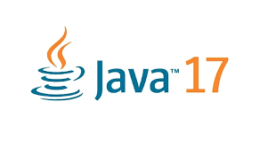

# tutorials-app


|                                                                                                       |                                                                                                           |                                                                                                   |
|:-----------------------------------------------------------------------------------------------------:|:---------------------------------------------------------------------------------------------------------:|:-------------------------------------------------------------------------------------------------:|
|     Java      | Spring Boot   |  Lombok   |
| MapStruct  | QueryDsl        | MongDb     |

## Setup:
Clone the repository
```bash
git clone git@github.com:Ricardolv/tutorials-app.git && cd tutorials-app   
mvn clean install -DskipTests 
```

Maven
```bash
mvn clean install -DskipTests 
```

Docker Compose
```bash
cd tutorials-app/docker && docker-compose up -d
```

Start project
```bash
mvn spring-boot:run
```

